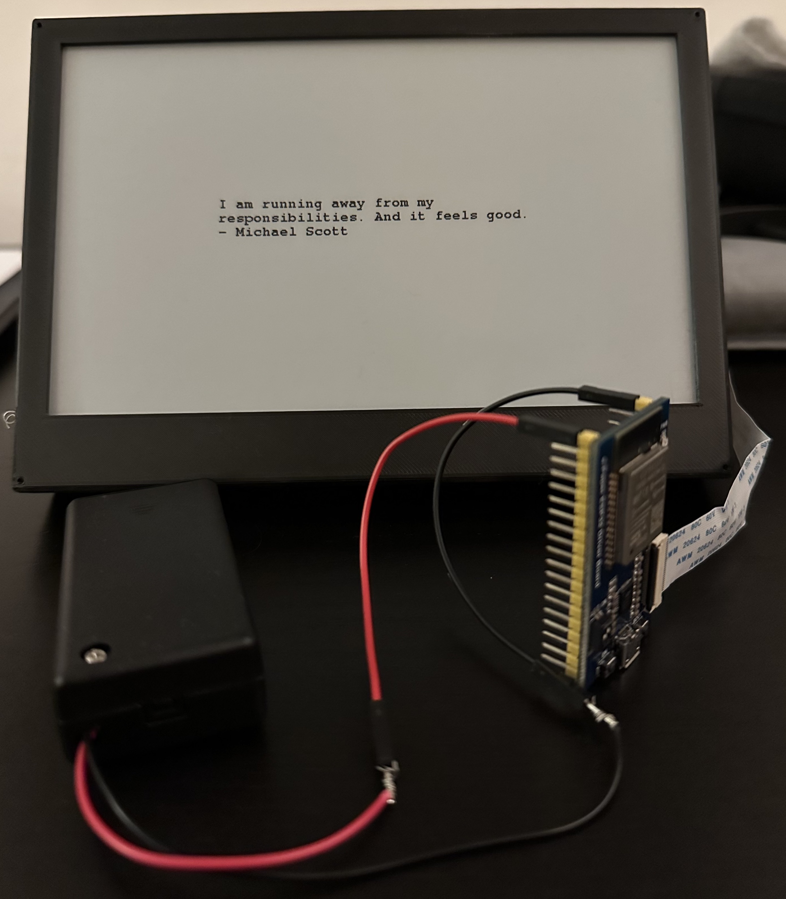

# Somehow I Manage

If you need some inspiration from *The Office* to get you through the day, this little Arduino project might be it!



## prerequisites

Get yourself an E-Ink / e-Paper display and esp32, I got the following for this project (it's pre-configured for them):

- [Arduino IDE](https://www.arduino.cc/en/software)
- [Waveshare ESP32 Driver Board](https://www.waveshare.com/e-Paper-ESP32-Driver-Board.htm)
- [800×480, 7.5inch E-Ink display](https://www.waveshare.com/7.5inch-e-paper-hat.htm)

Alternatively, if you don't want to buy anything but still read the quotes, [just go here](https://sim.ilayk.com).

## configuration

If you got the exact hardware as linked above, you just need to open up the `sim-dashbard.ino` sketch in your Arduino IDE and update line `6` and `7` with your Wi-Fi credentials and upload the code to your ESP32.

If you have a different display, you need to update the `GxEPD2_display_selection_new_style.h` file and **comment out line 59** by adding `//` in front of it, like so:

```
//#define GxEPD2_DRIVER_CLASS GxEPD2_750_T7  // GDEW075T7   800x480, EK79655 (GD7965)
```

…now find the corresponding configuration for your display and uncomment the given line to use the right library for hardware.

You can find more information about supported displays and how they're named in the code [here](https://github.com/ZinggJM/GxEPD2).

## Licenses

[they're included here](LICENSES.md)
